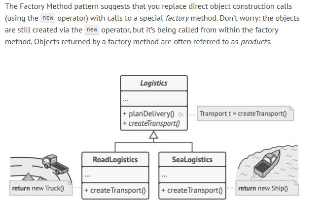

# 🏭 Factory Design Pattern

---

## 🔍 What is it?

> “The factory method is a creational design pattern that provides an interface for creating objects in a superclass but allows subclasses to alter the type of objects that will be created.”  
> — _LeetCode_

The **Factory Method Pattern** abstracts the process of object creation. Rather than calling a constructor directly (e.g., `new Car()`), you delegate that responsibility to a method (`createVehicle()`), which can be overridden or configured.

This can:
- Encapsulate complex instantiation logic
- Defer the exact type of object to subclasses or runtime
- Improve testability and flexibility
- Allow caching or reuse of existing objects

It’s **situational**—best used when creation logic varies or is complex.



---

## ✅ When should you use it?

Use the Factory Method Pattern when:
- **Object creation is complex** and you want to encapsulate or abstract it.
- **You need flexibility** in deciding which subclass to instantiate at runtime.
- You want to **reuse or cache objects** instead of creating new ones each time.
- You need to follow **Open/Closed Principle** (extend behavior without modifying existing code).
- You want to **decouple clients** from concrete implementations.

Examples:
- Creating **connections to different databases**
- Instantiating different **UI components** based on user input or configuration
- Working with **plugins or strategy objects**

---

## 🚫 When *not* to use it

Avoid the Factory Method when:
- Object construction is **simple and unlikely to change**.
- You’re not anticipating the need for **different subclasses or variants**.
- You don’t need **control over the instantiation process**.
---

## 💻 Code Example (Java)

```java
// Common interface for all vehicle types
interface Vehicle {
    String getType();
}

// Concrete implementations
class Car implements Vehicle {
    public String getType() { return "Car"; }
}

class Bike implements Vehicle {
    public String getType() { return "Bike"; }
}

class Truck implements Vehicle {
    public String getType() { return "Truck"; }
}

// Abstract Factory defines the method to create a Vehicle
abstract class VehicleFactory {
    abstract Vehicle createVehicle();
}

// Concrete Factories override the creation logic
class CarFactory extends VehicleFactory {
    Vehicle createVehicle() {
        return new Car();
    }
}

class BikeFactory extends VehicleFactory {
    Vehicle createVehicle() {
        return new Bike();
    }
}

class TruckFactory extends VehicleFactory {
    Vehicle createVehicle() {
        return new Truck();
    }
}

// Usage
public class Main {
    public static void main(String[] args) {
        VehicleFactory factory = new CarFactory();
        Vehicle myVehicle = factory.createVehicle();
        System.out.println(myVehicle.getType());  // Output: Car
    }
}
